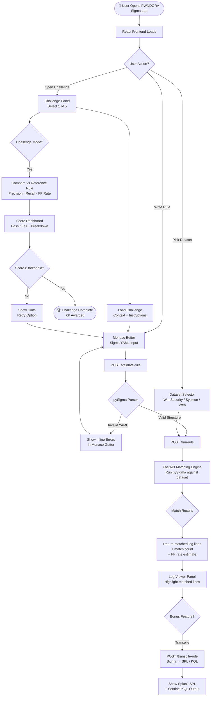

# Architecture Documentation — Sigma Rule Lab & Validation Engine

This document details the system design, components, and data flows of the **Sigma Rule Builder & Live Validation Engine**.

---

## 1. System Topology

The lab uses a three-tier system:



---

## 2. API Communication Layer

```mermaid
flowchart LR
    subgraph CLIENT["🖥️ React Frontend"]
        CE[Monaco Editor]
        DS[Dataset Picker]
        CH[Challenge UI]
        LV[Log Viewer]
        SD[Score Dashboard]
    end

    subgraph API["⚙️ FastAPI Backend"]
        JA[JWT Auth\nMiddleware]
        VR[POST\n/validate-rule]
        RR[POST\n/run-rule]
        GL[GET\n/log-datasets]
        GC[GET\n/challenges]
        SB[POST\n/challenges/{id}/submit]
        TR[POST\n/transpile-rule]
    end

    subgraph ENGINE["🔍 pySigma Engine"]
        SP[Sigma Parser]
        CV[YAML Structure\nValidator]
        ME[Log Matching\nEngine]
        SC[Score Calculator\nPrecision·Recall·FP]
    end

    subgraph DATA["📁 Data Layer (JSON)"]
        WS[windows_security.json\nEvent IDs 4624·4625·4698]
        SY[sysmon.json\nEvent IDs 1·10·13]
        WA[web_access.json\nHTTP access logs]
        CB[challenge_definitions.json + reference_rules.json\n5 challenges; reference rules never leave the backend]
    end

    CE -->|rule YAML| JA
    DS -->|dataset name| JA
    CH -->|challenge_id| JA
    JA --> VR & RR & GL & GC & SB & TR

    VR --> SP --> CV
    RR --> ME
    SB --> ME
    GL --> WS & SY & WA
    GC --> CB
    SB --> CB

    ME --> WS & SY & WA
    ME --> SC

    CV -->|errors| CE
    SC -->|results| LV & SD
```

---

## 3. pySigma Match Evaluation Logic

1. **Parser Execution**: The backend reads the Sigma rule YAML and parses the `detection` block into query filters.
2. **Scan Iterator**: The engine runs a linear scan across the targeted log records (e.g. `windows_security.json`).
3. **Filter Modifiers**: Translates modifiers like `contains`, `startswith`, `endswith`, and `re` (regex) into matching functions.
4. **Boolean evaluation**: Applies boolean logic defined in the `condition` string (e.g. `selection and not filter`).
5. **Score Formula**:
   - **Precision**: `|User Matches ∩ Reference Matches| / |User Matches|` (Measures rule accuracy/low noise).
   - **Recall**: `|User Matches ∩ Reference Matches| / |Reference Matches|` (Measures rule coverage/catching the target attack).
   - **False Positive (FP) Penalty**: `1 - (Benign matched / Total benign)` (Penalizes rules that match noise).
   - **Final Score**: `Precision * 40 + Recall * 40 + FP Penalty * 20` (deterministic rating).

---

## 4. Implementation Status

- `/validate-rule`, `/run-rule`, `/log-datasets`, `/challenges`, `/challenges/{id}/submit`, `/user/progress`, `/leaderboard`, JWT auth, and rate limiting are all implemented and covered by `backend/app/verify_scores.py`.
- `/transpile-rule` is implemented using pySigma's real `SplunkBackend` and `KustoBackend` — not a hand-rolled string converter.
- `/explain-rule` (the LLM-assisted "why did my rule fail" endpoint) is **not implemented**. It was scoped as a bonus feature in the build spec, to be built only after the core engine was stable; the core engine took priority for the hackathon window.
